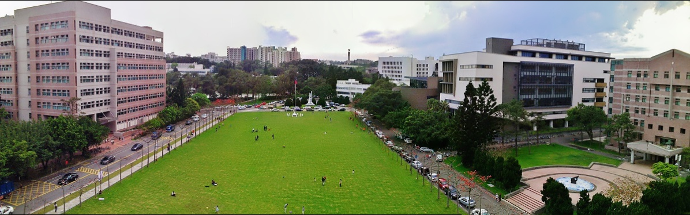
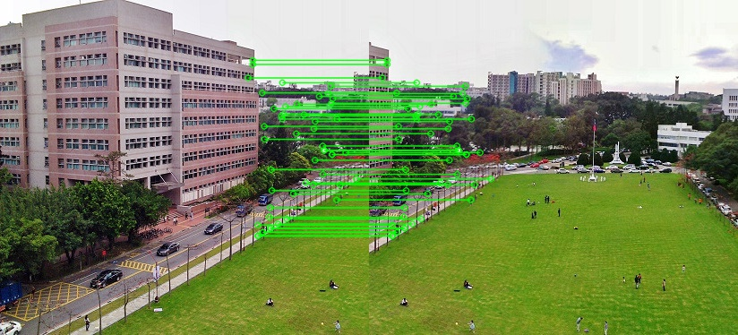
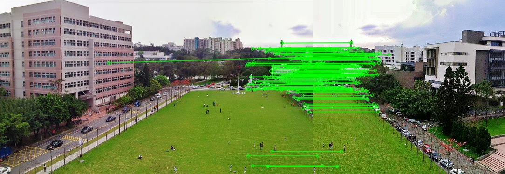
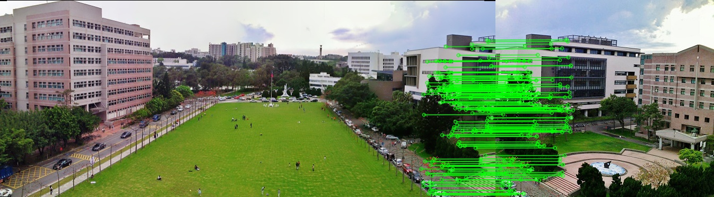

## a.Take multi-view images by ourselves

我們再小吃部前取景，multi_view部分的資料集請參閱

1. [multiview1_資料夾](https://github.com/Qi-Xian/HW_5_multi-view-3D-visual-effects/tree/master/multi_view1)
2. [multiview2_資料夾](https://github.com/Qi-Xian/HW_5_multi-view-3D-visual-effects/tree/master/multi_view2)

### 校景（找到相同的 allignment的feature match）

### 杯子multi_view（背景blur效果）

## b. Show image alignment results between different images

在alignment, Motion Parallax呈現，如下圖與source code連結。

[程式碼連結/Downloads](https://drive.google.com/file/d/1jk72tJ9wHROH4z565PjWAhtO1d9P3etD/view)

## c. Generate the multi-view 3D visual effects
我們使用校景的資料夾，使用SIFT偵測來找出feature match,找出之後，再輸出成動態圖。

一個人定位在中間，同樣使用sift偵測做出stop Motion effect，如下圖。

接下來，Live photo部分，我們一樣也都用SIFT演算法找到一個定位點，效果呈現上還得體（但背景有些沒有match到。）

[程式碼連結/HW_5.ipynb](https://colab.research.google.com/drive/1T1AhY79seiNjtU7YFA-nY-0XJLZnTQk0)
## d.Exploit creativity to add some image processing to enhance effect 
我們使用PS將照片做filter臨界值效果，再使用SIFT偵測去實作，雖然SIFT結果feature match減少幾條，但是在live photo影像反而效果更好，如下圖。

## e. 結論
這次，我們的時間實作上蠻趕的，也沒有足夠的時間使用其他演算法SURF, ORB來呈現，大部分都是用SIFT來實作，太整體效果上可以是得體的，也看了幾篇相關[Paper](http://webdiis.unizar.es/~aserrano/docs/Serrano_IEEEVR2019_VR-6dof.pdf)，然後看別人的[DEMO](https://drive.google.com/file/d/1NX240F5iU3lbzXH3MD7siSGM7gl8QpBk/view)，不妨大家可以實際試試看，然後改用其他的演算法去測試，會有出乎意外的實作效果。

## f. 參考文獻
1. [live_photo](https://david-smith.org/blog/2015/11/03/introducing-livetogif/)
2. [Motion parallax for 360° RGBD video](http://webdiis.unizar.es/~aserrano/projects/VR-6dof.html#downloads)
3. [STOP_MOTION實作](https://github.com/zuzmeister/StopMotion)

